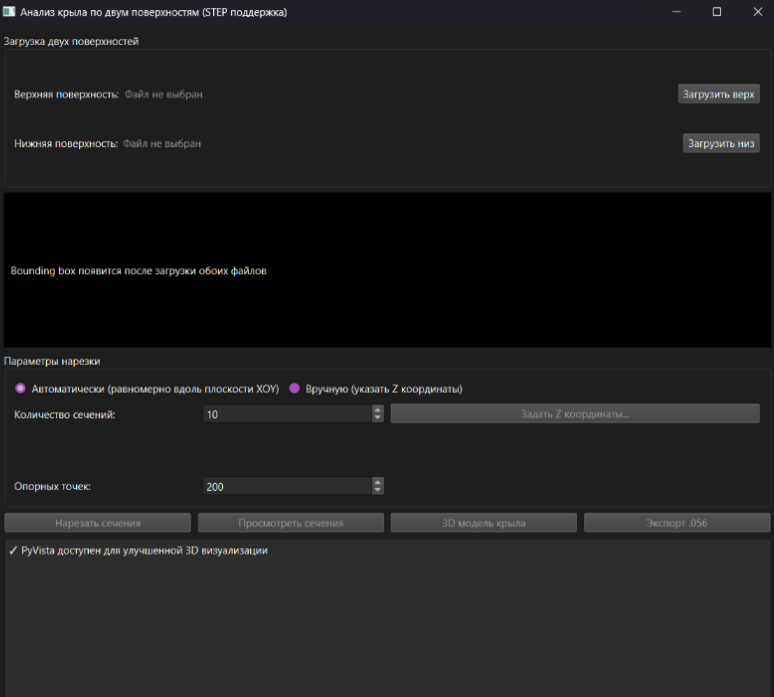
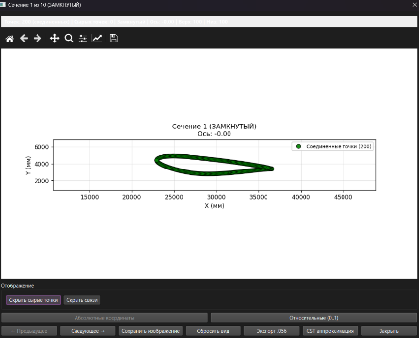
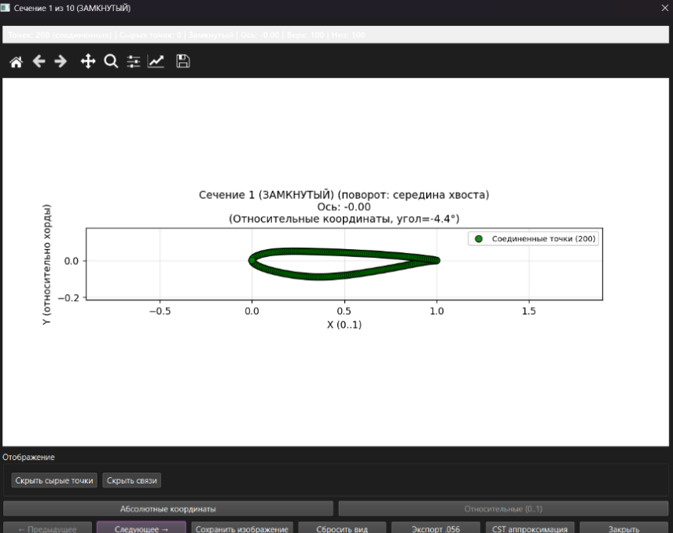
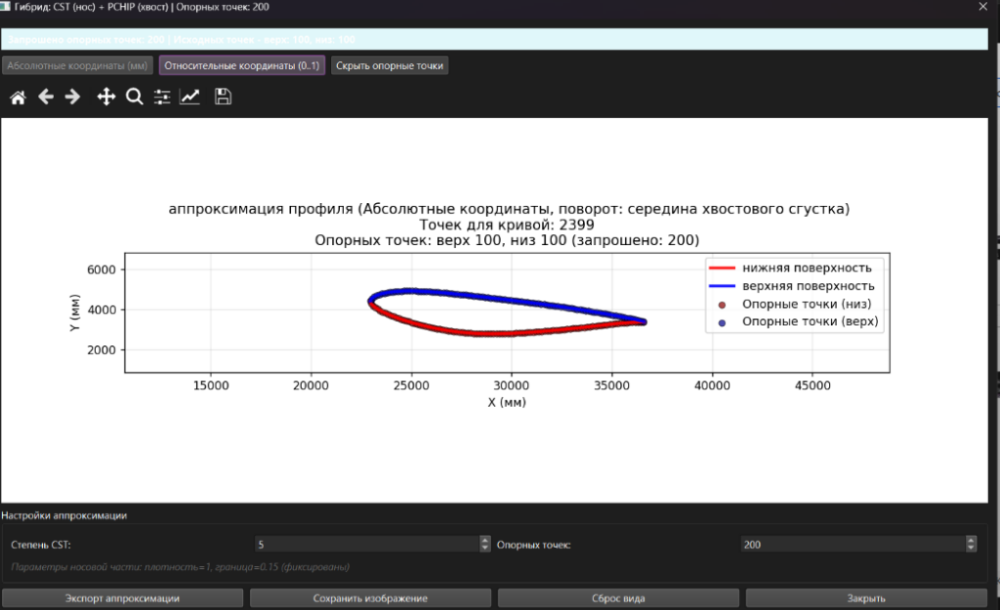
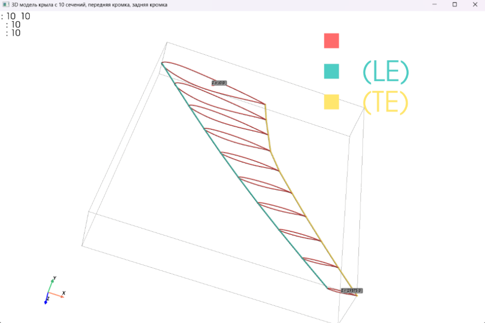
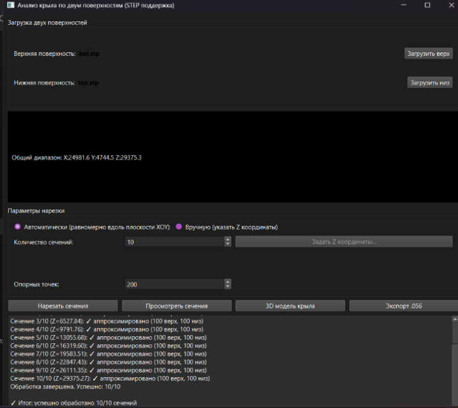
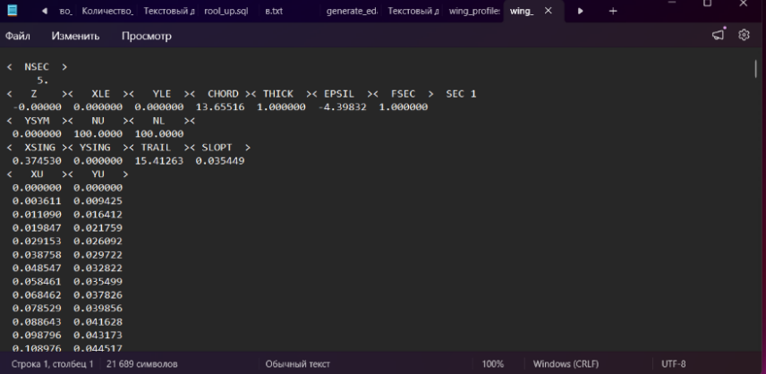

# Wing Analyzer

**Инструмент для аэродинамического анализа крыла по двум STEP-файлам поверхностей**

---

## О проекте

Приложение предназначено для анализа геометрии крыла летательного аппарата.  
Исходные данные — два STEP-файла, представляющих верхнюю и нижнюю поверхности.

Программа автоматически выполняет нарезку сечений вдоль оси Z, строит профили, проводит гибридную аппроксимацию и обеспечивает визуализацию результатов в 2D и 3D.

Разработано в рамках демонстрации инженерных компетенций (пет-проект).

---

## Возможности

- Загрузка двух STEP-файлов (верхняя и нижняя поверхности)
- Автоматическое или ручное задание координат сечений по оси Z
- Гибридная аппроксимация профилей: CST для носовой части, PCHIP для хвостовой
- Визуализация сечений в абсолютных и относительных координатах
- Построение трёхмерной модели крыла с выделением передней и задней кромок
- Экспорт результатов в авиационный формат .056
- Многопоточная обработка (интерфейс не блокируется во время расчётов)

---

## Технологический стек

- Python 3.9+
- PySide6 (GUI)
- pythonocc-core (работа с STEP, геометрические операции)
- NumPy, SciPy (численные методы, оптимизация, интерполяция)
- Matplotlib (2D и 3D визуализация)
- PyVista (опционально, для улучшенной 3D визуализации)

---

## 📁 Структура проекта

```
wing-analyzer/
├── src/
│   ├── wing_analyzer.py               # Ядро: CST, визуализаторы, экспорт
│   └── wing_analyzer_two_files.py     # GUI: главное окно, обработка
├── assets/                             # Скриншоты интерфейса
├── tests/                              # Модульные тесты
├── docs/                               # Документация
├── examples/                           # Примеры STEP-файлов
├── run.py                              # Точка входа
├── requirements.txt                    # Зависимости Python
├── .gitignore                          # Исключения для Git
└── README.md                           # Этот файл
```

---
---

## Скриншоты

### Главное окно приложения


### Визуализация сечений

**Сырые точки в абсолютных координатах**


**Сырые точки в относительных координатах**


### Аппроксимация профиля


### Трёхмерная модель крыла


### Нарезанные сечения (общий вид)


### Экспорт в формат .056


---

## Установка и запуск

### Требования

- Python 3.9 или новее
- Git
- Visual C++ Redistributable (для pythonocc-core на Windows)

### Установка

```bash
git clone https://github.com/sssemen2025-gif/wing-analyzer.git
cd wing-analyzer

python -m venv venv

# Windows:
venv\Scripts\activate
# Linux/Mac:
source venv/bin/activate

pip install -r requirements.txt
```

### Запуск

```bash
python run.py
```

---

##  Как пользоваться

1. Загрузите два STEP-файла: верхнюю и нижнюю поверхности крыла
2. Выберите метод нарезки: автоматический (равномерно по Z) или ручной
3. Настройте количество опорных точек (по умолчанию 200)
4. Нажмите «Нарезать сечения»
5. Просмотрите результаты: 2D сечения, 3D модель, экспорт в .056

---

##  Формат экспорта .056

Специализированный формат для аэродинамических расчётов. Содержит координаты сечений, параметры профиля (хорда, толщина, углы) и нормализованные координаты верхней и нижней поверхностей.

---

##  Автор

**Савенков Семен**

Проект создан в рамках демонстрации компетенций в области:
- Инженерного ПО на Python
- Вычислительной геометрии
- GUI-разработки (PySide6)
- Работы с CAD-форматами (STEP)

---

*Дата создания: Июнь 2026*
